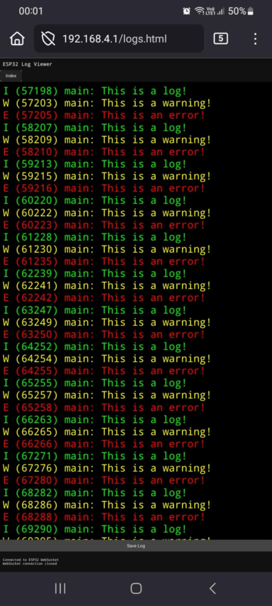

# ESP_LOG To Webpage Example

This example demonstrates how to send the ESP_LOG logs to a webpage on the ESP32 for wireless log viewing in ESP-IDF.

The microcontroller streams `ESP_LOG` output directly to a browser webpage via WebSocket, which may be viewed in real time or saved as a .txt file for later review.

## Features

- Creates a basic WebSocket server on the ESP32
- Serves a simple HTML website to the client
- Redirects ESP-IDF `ESP_LOG` output to WebSocket, using ESP-IDF's `esp_log_set_vprintf()` function
- Wireless live log view in the browser without a serial monitor.

## Requirements

- [ESP-IDF v5.x+](https://docs.espressif.com/projects/esp-idf/en/latest/esp32/get-started/)

- Any ESP32 development board (ESP32, ESP32-S3, etc.)

- Browser with WebSocket support (any modern browser).

## Build and Flash

1. Clone this repo inside your ESP-IDF workspace:

	```
	git clone https://github.com/Georgi9060/esp_logs_to_web.git
	```
2. Set up your Wi-Fi SSID and password:

	In the file *set_up_wifi.h*, set `EXAMPLE_ESP_WIFI_SSID` and `EXAMPLE_ESP_WIFI_PASS` to whatever you wish.

	**This example makes the ESP32 an Access Point!** If you wish for it to be a station and connect to an AP instead, please change the *set_up_wifi.h* and *.c* files so they include the Wi-Fi station setup. You may use the [ESP-IDF Wi-Fi station example](https://github.com/espressif/esp-idf/tree/master/examples/wifi/getting_started/station) as a reference.

3. Build and flash:
	```
	idf.py build flash monitor
	```

## Usage

1.  After flashing, check the serial monitor for the ESP32’s IP address:
	```
	I (813) wifi softAP: wifi_init_softap finished. SSID:ESP32 Web Logs password:mypassword 	channel:6
	I (814) esp_netif_lwip: DHCP server started on interface WIFI_AP_DEF with IP: 192.168.4.1
	I (828) main: ESP32 Access Point running...
	```
2. Open a browser and go to:
	```
	http://192.168.4.1/index.html
	```
3. You should see the simple webpage.  The log output from `ESP_LOGI`, `ESP_LOGW`, `ESP_LOGE`, etc. will stream live into the browser via WebSocket.

## Screenshot


## Credits
**ESP32Tutorials**:  For providing the original [ESP32 WebSocket Web Server example](https://github.com/ESP32Tutorials/ESP32-ESP-IDF-WebSocket-Web-Server-).